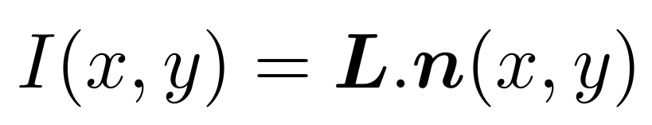
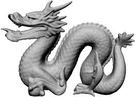

# Shape from Shading

This work was part of a **C++ academic project**.  
The original project handout (in **French**) can be found in the `doc` folder.

---

## Introduction

**Shape from shading (SfS)** is a computer vision problem that aims to reconstruct the **surface relief of a scene from a single image**. SfS was initiated in the 1960s by the astronomer **Rindfleish**, through the publication of a paper on lunar tomography. However, it was only in the 1970s, with the work of **Horn and Brooks**, that shape from shading became a field of study in its own right.

Their contributions addressed the **physical modeling of the problem**, the **uniqueness of solutions**, and **numerical resolution methods**. Their book remains a fundamental reference in the field.

---

## Modeling

In this project, we assume that the grayscale intensity of the image depends **only on the direction of the incident light** and the **surface normal** (Lambertian reflectance model):

where  
- **I** is the image intensity (typically I ∈ [0, 255]),  
- **L** is the incident light direction,  
- **n** is the outgoing unit surface normal.

The main difficulty in solving this problem lies in its **nonlinearity**, which arises from the normalization of the normal vector **n**.

Assuming a **frontal light source** located at (0, 0, 1), and maximal intensity when **n** and **L** are aligned, the shading equation can be rewritten—after normalization—as the **eikonal equation**.

---

## Resolution

Deterministic optimization methods for shape from shading consist in **minimizing functionals** that measure the discrepancy between the **directional derivatives of a surface** and the observed luminance.

Two penalty terms are typically added:

1. **Integrability constraint**, ensuring that the estimated gradient field corresponds to a valid surface (Schwarz’s condition on mixed derivatives).
2. **Smoothness constraint**, penalizing non-smooth or noisy solutions.

These functionals are discretized using **off-centered finite differences**.

The main challenge of this project was to implement, in **C++**, the numerical resolution of the optimization problems related to SfS using the **L-BFGS algorithm**.  
Additionally, an `ImageFactory` class was developed to generate test images from **analytical or discrete 3D surfaces**.

---

## Results

The goal of this project was to build a **complete C++ pipeline**, rather than to tune hyperparameters for optimal reconstruction quality.

Input image and reconstructed mesh:

---

## Build the Project

Generate the binary using the provided Makefile:

    make

---

## Clean Build Files

Remove object files and the binary:

    make clean

---

## Run the Program

    ./bin/app

---

## Mesh Visualization

Meshes can be visualized using the **Vizir** software (developed by  
Adrien Loseille: http://pages.saclay.inria.fr/adrien.loseille/),  
available in the `mesh` folder.
